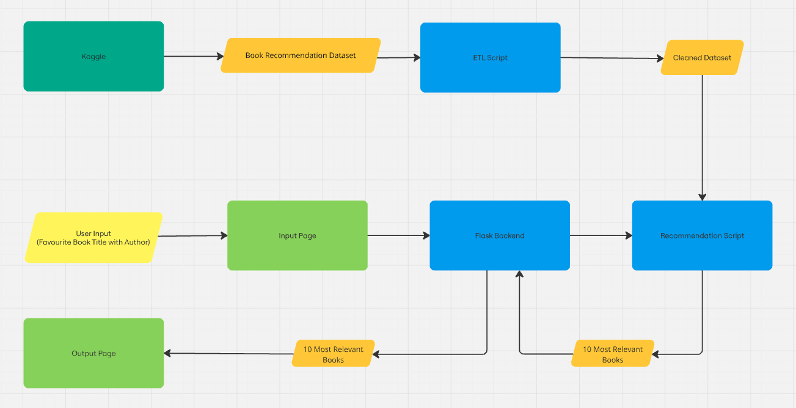
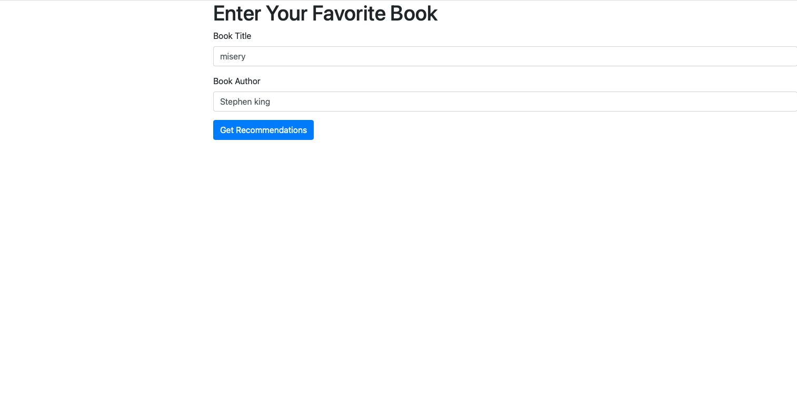
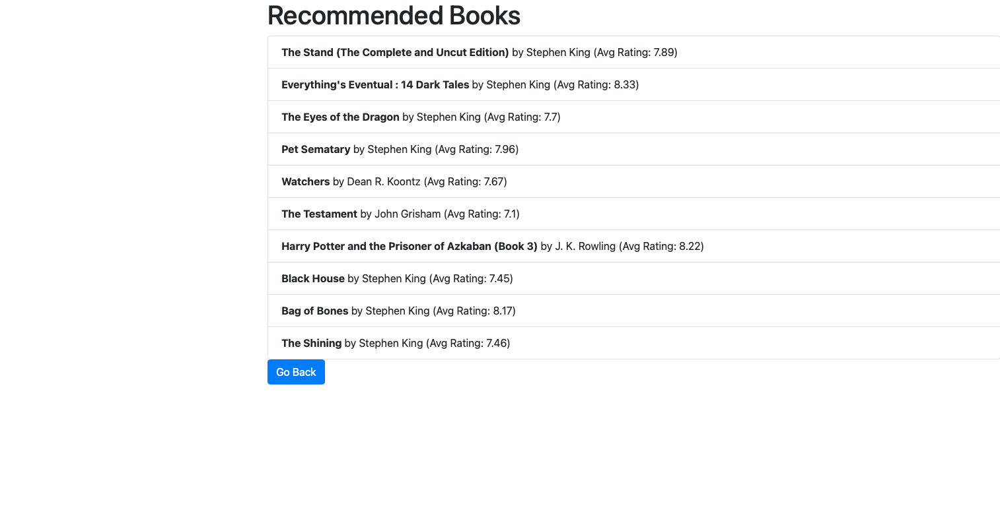

#### This project implements a Book Recommendation System using collaborative filtering techniques. 
# Project structure
```bash
├── data/                      # Directory to store datasets
├── notebooks/                 # Jupyter notebooks
│   ├── data_etl.ipynb         # ETL process notebook
│   └── code_review.ipynb      # Notebook with code review of the original recommendation script
├── scripts/                   # Python scripts for project functionalities
│   ├── book_rec_user_input.py # Main script that generates a list of recommended books
│   └── etl.py                 # Script with functions for data processing
├── web_app/                   # Web application directory
│   ├── templates/             # HTML templates for the web interface
│   │   ├── index.html         # Main page of the web app
│   │   └── recommend.html     # Book recommendation result page
│   └── flask_app.py           # Main Flask application
├── README.md                  # Project description and instructions
└── requirements.txt           # Python dependencies for the project
```
# Application Schema

# Example
### Main Page:
 
 ### Recommendations Page:
 
## Installation
Create a virtual environment and install the dependencies.
```sh
conda create --name <env> --file requirements.txt
```
## Datasets
#### Books.csv:
Books are identified by their respective **ISBN**. Moreover, some content-based information is given, such as:
- **Book-Title**
- **Book-Author**
- Year-Of-Publication
- Publisher

This information was obtained from Amazon Web Services. Note that in cases where there are multiple authors, only the first author is provided. Additionally, URLs linking to cover images are given in three sizes:
- Image-URL-S (small)
- Image-URL-M (medium)
- Image-URL-L (large)

#### Ratings.csv:
This file contains the book rating information. Ratings (**Book-Rating**) are provided in two forms:
- **Explicit Ratings**: A rating on a scale from 1 to 10, with higher values indicating greater appreciation.
- **Implicit Ratings**: A rating of 0.
Dataset also contains:
- **ISBN**
- **User-ID**
## ETL Process Description
- Download the datasets using Kaggle API
- Read the data, select relevant columns
- Remove observations with invalid ISBN in both datasets
- **Books.csv:**
- - Normalize string columns (Lowercase, no punctuation, no diacritics)
- - Fill the missing values for Author column with default value
- **Ratings.csv:**
- - Remove implicit ratings (A ratings of 0)
- - Remove observations containing any missing values
- Save cleaned datasets
## 